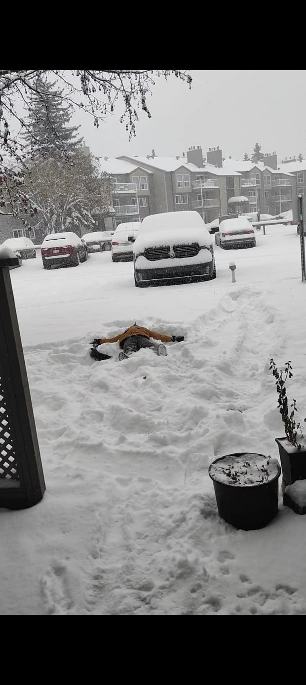

# 📸 Project Media Guide - Bhavithra's Portfolio

## How to Add Images and Videos to Your Projects

### 🗂️ Folder Structure

Your portfolio directory should have this structure:

```
portfolio/
├── images/
│   ├── my-photo.jpg (your profile photo - already exists)
│   └── projects/
│       ├── space-debris-tracking.mp4 (from tracking_result.mp4)
│       ├── space-debris-thumb.jpg (screenshot from the video)
│       ├── snow-detection.jpg (from IT597 Project images)
│       ├── geo-qr-attendance.jpg (from Project_Report_ITM_Final.docx)
│       ├── chatbot-gui.jpg (screenshot of the chatbot interface)
│       └── ... (other project media)
```

### 📷 Adding Images

**Step 1:** Place your images in `images/projects/` folder

**Step 2:** In `index.html`, replace the placeholder with your image:

```html
<!-- Replace this: -->
<div class="media-placeholder" data-media-type="image">
    <i class="fas fa-image"></i>
    <span>Add Project Screenshot</span>
</div>

<!-- With this: -->

```

**Recommended Image Specs:**
- Format: JPG or PNG
- Resolution: 1920x1080 or 1280x720
- Aspect Ratio: 16:9
- File Size: Under 2MB for faster loading
- Optimize images using tools like TinyPNG or ImageOptim

### 🎥 Adding Videos

**Step 1:** Place your videos in `images/projects/` folder

**Step 2:** In `index.html`, replace the placeholder with your video:

```html
<!-- Replace this: -->
<div class="media-placeholder" data-media-type="video">
    <i class="fas fa-video"></i>
    <span>Add Project Demo Video</span>
</div>

<!-- With this: -->
<video controls poster="images/projects/video-thumbnail.jpg">
    <source src="images/projects/your-video.mp4" type="video/mp4">
</video>
```

**Recommended Video Specs:**
- Format: MP4 (H.264 codec)
- Resolution: 1920x1080 or 1280x720
- Duration: 30 seconds - 2 minutes (shorter is better)
- File Size: Under 10MB
- Frame Rate: 30fps
- Add a thumbnail poster image for better UX

### 🎨 Multiple Images (Gallery View)

To add multiple images for a project:

```html
<div class="project-media gallery">
    
    
    
</div>
```

### ⚡ Features You Get

1. **Lightbox Modal** - Click any image/video to view fullscreen
2. **Video Controls** - Play, pause, volume, fullscreen
3. **Smooth Animations** - Hover effects and transitions
4. **Responsive** - Works perfectly on all devices
5. **Keyboard Support** - Press ESC to close lightbox

### 🎯 Best Practices

**For Images:**
- Show your project in action
- Use screenshots of the UI/dashboard
- Include before/after comparisons
- Show key features or results
- Use high-quality, clear images

**For Videos:**
- Keep it short and focused (30-90 seconds)
- Show the most impressive features
- Add captions if needed
- Ensure good audio quality
- Start with the most engaging part
- Use screen recording tools like OBS Studio, Loom, or QuickTime

### 🛠️ Video Creation Tips

1. **Screen Recording:** Use OBS Studio (free) or Loom
2. **Editing:** Use DaVinci Resolve (free) or Adobe Premiere
3. **Compression:** Use HandBrake to reduce file size
4. **Format:** Export as MP4 with H.264 codec
5. **Thumbnail:** Take a screenshot of the best frame

### 📱 Example Implementation

Here's a complete example for the Geo QR Attendance project:

```html
<div class="project-card">
    <div class="project-header">
        <i class="fas fa-qrcode project-icon"></i>
    </div>
    
    <!-- Video with thumbnail -->
    <div class="project-media">
        <video controls poster="images/projects/geo-qr-thumb.jpg" data-caption="QR Attendance System Demo">
            <source src="images/projects/geo-qr-demo.mp4" type="video/mp4">
        </video>
    </div>
    
    <h3>Geo QR Attendance System</h3>
    <!-- Rest of the project details -->
</div>
```

### 🎬 Where to Host Large Videos

If your videos are too large:
1. Upload to YouTube (set as unlisted)
2. Use the embed code instead
3. Or use cloud storage (Google Drive, Dropbox) with direct links

### 📋 Your Specific Projects - Media Checklist

#### 1. Space Debris Detection (Featured Project)
**Source:** `C:\Users\bhavi\Downloads\tracking_result (1).mp4`
- [ ] Copy `tracking_result (1).mp4` to `portfolio/images/projects/space-debris-tracking.mp4`
- [ ] Create a thumbnail: Open video, take screenshot of best frame, save as `space-debris-thumb.jpg`
- [ ] In `index.html`, find the SpaceVisionAI project and replace the placeholder with:
```html
<video controls poster="images/projects/space-debris-thumb.jpg" data-caption="Real-time Space Debris Tracking">
    <source src="images/projects/space-debris-tracking.mp4" type="video/mp4">
</video>
```

#### 2. Snow Detection System
**Source:** `C:\Users\bhavi\Downloads\IT597 Project\snow_detection_webapp\` (52 images available)
- [ ] Select 1-2 best detection result images from the webapp folder
- [ ] Copy to `portfolio/images/projects/snow-detection-1.jpg` and `snow-detection-2.jpg`
- [ ] In `index.html`, find the Snow Detection project and replace the placeholder with:
```html
<div class="project-media gallery">
    
    
</div>
```
Or use a single image:
```html

```

#### 3. Geo QR Attendance System
**Source:** Extract images from `C:\Users\bhavi\Downloads\Project_Report_ITM_Final.docx`
- [ ] Open the Word document
- [ ] Save embedded screenshots/images from the document
- [ ] Copy the best UI/dashboard screenshot to `portfolio/images/projects/geo-qr-attendance.jpg`
- [ ] Alternatively, take screenshots of the running application if available
- [ ] In `index.html`, find the Geo QR Attendance project and replace the placeholder with:
```html

```

#### 4. Interactive Chatbot
**Source:** Run the chatbot (`C:\Users\bhavi\Downloads\Final chatbot.py`) and take screenshots
- [ ] Run the Python script: `python "Final chatbot.py"`
- [ ] Take screenshots of:
  - Initial greeting screen
  - Conversation with mood detection
  - Quiz or age guessing feature
- [ ] Save as `portfolio/images/projects/chatbot-gui.jpg`
- [ ] In `index.html`, find the NLP Chatbot project and replace the placeholder with:
```html

```

### 🎯 Quick Instructions Summary

1. **Copy your media files to the correct location:**
   ```bash
   # Windows Command Prompt or PowerShell
   # Navigate to your portfolio folder
   cd C:\Users\bhavi\portfolio
   
   # Copy space debris video
   copy "C:\Users\bhavi\Downloads\tracking_result (1).mp4" "images\projects\space-debris-tracking.mp4"
   
   # For other files, manually select and copy the best images
   ```

2. **Replace placeholders in index.html:**
   - Search for `media-placeholder` in the HTML
   - Replace with the appropriate `` or `<video>` tag
   - Use the examples provided above

3. **Test your portfolio:**
   - Open `index.html` in your browser
   - Click on images/videos to test the lightbox modal
   - Ensure all media loads correctly

### 🎨 Image Editing Tips

**For Screenshots:**
- Use Windows Snipping Tool (Win + Shift + S)
- Crop to show the most important parts
- Ensure text is readable

**For Video Thumbnails:**
- Open video in VLC or Windows Media Player
- Pause at the most impressive frame
- Take screenshot (VLC: Video > Take Snapshot)

**Optimization:**
- Before adding, compress images at https://tinypng.com
- Keep file sizes under 500KB for images, 10MB for videos
- Use JPG for photos, PNG for UI screenshots

### 🚀 Optional Enhancements

1. **Create a project showcase GIF:**
   - Record short clips using Windows Game Bar (Win + G)
   - Convert to GIF using https://ezgif.com/video-to-gif
   - Add to featured projects for extra impact

2. **Add multiple angles:**
   - For web applications: Show desktop + mobile views
   - For ML projects: Show input, processing, and output
   - Use the gallery view in HTML

### Need Help?

- Optimize images: https://tinypng.com
- Convert video: https://handbrake.fr
- Screen recording: Windows Game Bar (Win + G) or https://obsproject.com
- Edit video: https://www.blackmagicdesign.com/products/davinciresolve
- Take screenshots: Windows Snipping Tool (Win + Shift + S)

### ✅ Checklist Before Publishing

- [ ] All placeholder divs replaced with actual media
- [ ] Images optimized (under 500KB each)
- [ ] Videos compressed (under 10MB)
- [ ] All media files in correct folder
- [ ] Tested lightbox modal functionality
- [ ] Verified links work in all browsers
- [ ] Mobile responsive check

Happy showcasing! 🚀
