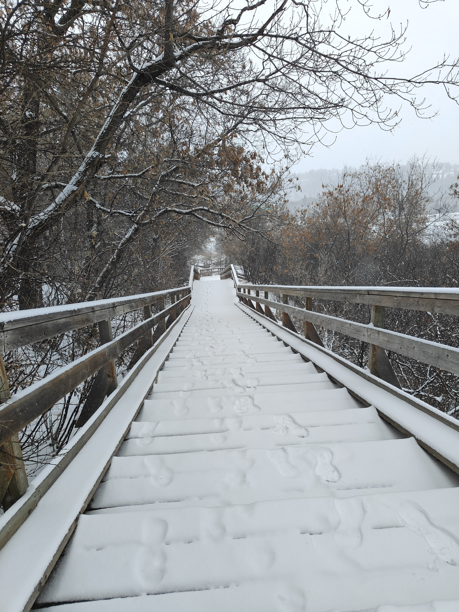

# 🚀 Quick Start Guide

## ⚡ Get Your Portfolio Live in 5 Steps

---

## Step 1: Add Your Project Media (10-15 minutes)

### Option A: Use the Automated Script
1. Double-click `COPY_MEDIA_FILES.bat`
2. Follow the on-screen instructions
3. Complete the manual steps shown

### Option B: Manual Copy
Copy these files to `portfolio/images/projects/`:

```
✅ Space Debris Video:
   From: C:\Users\bhavi\Downloads\tracking_result (1).mp4
   To: portfolio/images/projects/space-debris-tracking.mp4

✅ Snow Detection Images:
   From: C:\Users\bhavi\Downloads\IT597 Project\snow_detection_webapp\
   To: portfolio/images/projects/snow-detection-1.jpg
   (Select 1-2 best images)

✅ Attendance System Screenshots:
   From: C:\Users\bhavi\Downloads\Project_Report_ITM_Final.docx
   To: portfolio/images/projects/geo-qr-attendance.jpg
   (Extract and save screenshots)

✅ Chatbot Screenshot:
   1. Run: python "C:\Users\bhavi\Downloads\Final chatbot.py"
   2. Take screenshot (Win + Shift + S)
   3. Save to: portfolio/images/projects/chatbot-gui.jpg
```

**Need detailed help?** → See `PROJECT_MEDIA_GUIDE.md`

---

## Step 2: Replace HTML Placeholders (5 minutes)

Open `index.html` and find these sections:

### 🎬 Space Debris Project
Find: `<!-- To add tracking video: Place tracking_result.mp4`

Replace the entire `<div class="media-placeholder">` block with:
```html
<video controls poster="images/projects/space-debris-thumb.jpg">
    <source src="images/projects/space-debris-tracking.mp4" type="video/mp4">
</video>
```

### ❄️ Snow Detection Project
Find: `<!-- To add: Place snow detection images`

Replace with:
```html

```

### 📱 Geo QR Attendance
Find: `<!-- To add: Place attendance tracking screenshots`

Replace with:
```html

```

### 🤖 Chatbot Project
Find the chatbot media placeholder

Replace with:
```html

```

**Tip:** Search for `media-placeholder` in your editor to find all instances!

---

## Step 3: Test Locally (2 minutes)

### Open in Browser
1. Navigate to `C:\Users\bhavi\portfolio`
2. Double-click `index.html`
3. Your portfolio opens in your default browser

### Quick Test Checklist
- [ ] All sections load smoothly
- [ ] Animations play when scrolling
- [ ] Images/videos display correctly
- [ ] Click an image to test lightbox
- [ ] Navigation menu works
- [ ] Hover effects on cards work
- [ ] Scroll to bottom and click ↑ button

**Issues?** → See `README.md` → Troubleshooting section

---

## Step 4: Deploy to GitHub (3 minutes)

```bash
# Open Command Prompt or PowerShell
cd C:\Users\bhavi\portfolio

# Initialize Git (if not done)
git init

# Add all files
git add .

# Commit changes
git commit -m "Enhanced portfolio with smooth transitions and comprehensive project details"

# Add remote (if not done)
git remote add origin https://github.com/bhaviss/bhavithrass.io.git

# Push to GitHub
git push -u origin main
```

**First time?** You might need to login to GitHub:
```bash
git config user.name "Bhavithra SS"
git config user.email "bhavithrass@gmail.com"
```

---

## Step 5: Auto-Deploy to Vercel (Automatic!)

Since your GitHub repo is connected to Vercel:
- ✅ Vercel detects your push automatically
- ✅ Builds and deploys your site
- ✅ Live at: https://bhavithrass.vercel.app

**Check deployment:**
1. Go to https://vercel.com
2. Login to your account
3. Check deployment status
4. Visit your live site!

---

## 🎉 You're Done!

Your portfolio is now live with:
- ✨ Smooth professional transitions
- 🎨 Unique techie-style layouts
- 🚀 All projects and certifications
- 📱 Mobile responsive design
- 💫 Interactive animations

---

## 📱 Share Your Portfolio

### Update Your Profiles

**LinkedIn:**
1. Go to your profile
2. Edit "Contact Info"
3. Add website: `https://bhavithrass.vercel.app` (or `www.bhaviss.com`)

**GitHub:**
1. Go to your profile
2. Edit profile
3. Add website in bio

**Resume:**
- Add portfolio link to header
- Include QR code (optional)

---

## 🔄 Making Updates Later

When you want to add more projects or make changes:

```bash
# 1. Edit your files (index.html, style.css, etc.)

# 2. Stage changes
git add .

# 3. Commit with message
git commit -m "Update: Added new project"

# 4. Push to GitHub
git push

# 5. Vercel auto-deploys! ✨
```

---

## 📚 More Information

**For detailed documentation, see:**
- `README.md` - Complete project overview
- `PROJECT_MEDIA_GUIDE.md` - Media setup details
- `DEPLOYMENT_GUIDE.md` - Advanced deployment
- `CHANGES_SUMMARY.md` - What was changed

---

## ⚙️ Optional Enhancements

### Add Custom Domain (www.bhaviss.com)
1. Go to Vercel project settings
2. Add custom domain
3. Update DNS records
→ See `DEPLOYMENT_GUIDE.md` for details

### Add Google Analytics
1. Create GA4 account
2. Get tracking ID
3. Add script to `index.html`
→ See `DEPLOYMENT_GUIDE.md` for code

### Optimize Performance
- Compress images: https://tinypng.com
- Compress videos: https://handbrake.fr
- Test speed: https://pagespeed.web.dev

---

## 🆘 Quick Troubleshooting

### Problem: Images not showing
**Solution:** Check file paths in HTML match actual files in `images/projects/`

### Problem: Git push fails
**Solution:** 
```bash
git pull origin main --rebase
git push origin main
```

### Problem: Animations not working
**Solution:** Clear browser cache (Ctrl + Shift + Del) and hard refresh (Ctrl + F5)

### Problem: Mobile looks broken
**Solution:** The portfolio is responsive! Test on actual mobile device or use Chrome DevTools (F12) → Toggle device toolbar

---

## 💡 Pro Tips

1. **Take Screenshots:** Before deploying, take screenshots for LinkedIn posts
2. **Test on Mobile:** View on your phone to ensure everything looks good
3. **Share Widely:** Add to email signature, LinkedIn, GitHub, resume
4. **Keep Updated:** Add new projects as you complete them
5. **Get Feedback:** Share with friends/colleagues for improvement ideas

---

## 📞 Need Help?

**Can't find something?**
1. Check `README.md` for overview
2. See `PROJECT_MEDIA_GUIDE.md` for media help
3. Read `DEPLOYMENT_GUIDE.md` for deployment issues
4. Review `CHANGES_SUMMARY.md` for what changed

**Still stuck?**
- Check browser console (F12) for errors
- Verify all files are in correct locations
- Try opening in different browser
- Clear cache and try again

---

## ✅ Final Checklist

Before sharing your portfolio:

- [ ] All project images/videos added
- [ ] HTML placeholders replaced
- [ ] Tested in browser locally
- [ ] All animations working
- [ ] Mobile responsive check
- [ ] Links all work (GitHub, LinkedIn, etc.)
- [ ] Pushed to GitHub
- [ ] Deployed on Vercel
- [ ] Visited live URL and tested
- [ ] Updated LinkedIn profile
- [ ] Shared with network!

---

**🎊 Congratulations! Your portfolio is ready to showcase your amazing work!**

**Your Enhanced Portfolio:**
- 🌐 Live Site: https://bhavithrass.vercel.app
- 💼 GitHub: https://github.com/bhaviss/bhavithrass.io
- 👤 LinkedIn: https://www.linkedin.com/in/bhavithra-ss-/

---

*Created: January 23, 2026*
*Time to Complete: ~25 minutes*
